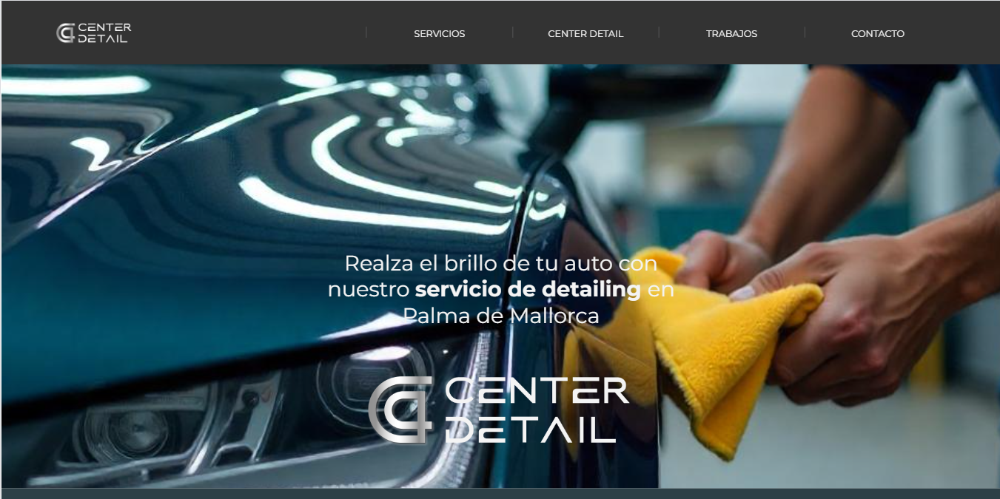

# Center Detail - Sucursal Mallorca

**Descripción del proyecto:** Plataforma web específica para la sucursal de Center Detail en Mallorca, adaptada a las necesidades locales de sus clientes para servicios de limpieza y mantenimiento de vehículos de lujo.

**Mi rol en el proyecto:** Desarrolladora Frontend, encargada de adaptar la plataforma general de la franquicia para la sucursal en Mallorca, manteniendo consistencia con la identidad de marca. Me aseguré de que la web estuviera optimizada para el público de Mallorca. **React.js**.

<h3>👉🏻 <b>Deploy: <a href="https://mallorca.center-detail.com" target="_blank">Center Detail Mallorca</a></b></h3>

---

## Tecnologías utilizadas:
- 
- 
- 
- 
- 
- 
